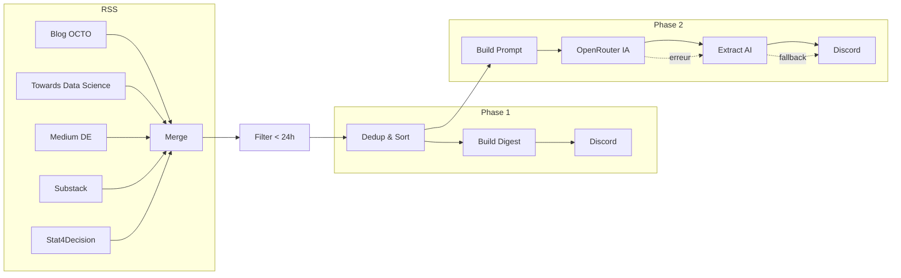

# 🧠 n8n Veille Auto — Veille Data Engineering automatisée

Pipeline d'automatisation de veille technologique avec [n8n](https://n8n.io/), RSS, Discord et IA (OpenRouter / DeepSeek).

## 📋 Fonctionnalités

| Phase | Description |
|-------|-------------|
| **Phase 1** | Agrégation RSS → filtre 24h → déduplication → digest Discord |
| **Phase 2** | Phase 1 + synthèse IA structurée (tendances, points clés, outils) |

- ✅ 5 flux RSS data engineering
- ✅ Déduplication automatique (pas de doublon d'un jour à l'autre)
- ✅ Digest unique Discord (pas de spam)
- ✅ Synthèse IA via OpenRouter (modèle configurable)
- ✅ Fallback si l'IA échoue (liste brute envoyée)
- ✅ Limite Discord 2000 chars respectée

## 🏗️ Architecture



## 🚀 Installation

### Prérequis

- [Docker](https://docs.docker.com/get-docker/) & [Docker Compose](https://docs.docker.com/compose/install/)
- Un webhook Discord ([créer un webhook](https://support.discord.com/hc/fr/articles/228383668))
- *(Phase 2)* Une clé API [OpenRouter](https://openrouter.ai/keys)

### 1. Cloner le repo

```bash
git clone https://github.com/VOTRE_USER/n8n-veille-auto.git
cd n8n-veille-auto
```

### 2. Configurer les variables d'environnement

```bash
cp .env.example .env
```

Éditez `.env` avec vos valeurs :

```env
N8N_BASIC_AUTH_PASSWORD=votre_mot_de_passe_fort
N8N_ENCRYPTION_KEY=$(openssl rand -hex 32)
DISCORD_WEBHOOK_URL=https://discord.com/api/webhooks/...
OPENROUTER_API_KEY=sk-or-v1-...
```

### 3. Lancer n8n

```bash
docker compose up -d
```

Accédez à n8n : **http://localhost:5678**

### 4. Importer les workflows

1. Ouvrez n8n dans votre navigateur
2. Menu **☰** → **Import from File**
3. Importez le workflow souhaité :
   - `workflows/veille_rss_sans_ia.json` — Phase 1 (sans IA)
   - `workflows/veille_rss_open_router_ia.json` — Phase 2 (avec IA)
4. **Activez** le workflow (toggle en haut à droite)

## ⚙️ Variables d'environnement

| Variable | Requis | Description |
|----------|--------|-------------|
| `N8N_BASIC_AUTH_ACTIVE` | ✅ | Active l'auth basique n8n |
| `N8N_BASIC_AUTH_USER` | ✅ | Utilisateur n8n |
| `N8N_BASIC_AUTH_PASSWORD` | ✅ | Mot de passe n8n |
| `N8N_ENCRYPTION_KEY` | ✅ | Clé de chiffrement credentials |
| `TZ` | ✅ | Fuseau horaire (`Europe/Paris`) |
| `DISCORD_WEBHOOK_URL` | ✅ | Webhook Discord du salon |
| `OPENROUTER_API_KEY` | Phase 2 | Clé API OpenRouter |
| `DEEPSEEK_API_KEY` | ❌ | Optionnel, si appel DeepSeek direct |

## 📡 Flux RSS configurés

| Source | URL | Thème |
|--------|-----|-------|
| Blog OCTO | `blog.octo.com/feed/` | Craft, tech, architecture |
| Towards Data Science | `towardsdatascience.com/feed` | Data science, ML |
| Medium | `medium.com/feed/tag/data-engineering` | Data engineering |
| Practical DE (Substack) | `practicaldataengineering.substack.com/feed` | Data engineering pratique |
| Stat4Decision | `stat4decision.com/feed/` | Stats, data, IA |

> 💡 Pour ajouter un flux : dupliquez un nœud RSS dans n8n, modifiez l'URL, et connectez-le au nœud Merge (pensez à incrémenter `numberInputs`).

## 🔄 Déduplication

La déduplication utilise `$getWorkflowStaticData('global')` (persistance native n8n) :

1. À chaque exécution, les liens des articles sont comparés au store
2. Seuls les articles **non encore envoyés** sont inclus
3. Les articles envoyés sont marqués avec un timestamp
4. Les entrées de plus de **30 jours** sont nettoyées automatiquement

> Résultat : même si un article reste dans le flux RSS plusieurs jours, il ne sera envoyé qu'une seule fois.

## 🤖 Phase 2 — Synthèse IA

Le workflow Phase 2 envoie la liste d'articles à **OpenRouter** (modèle par défaut : `deepseek/deepseek-chat`) pour produire :

- 📊 **Tendances du jour** (2-3 tendances)
- 🔑 **5 points clés** (bullet points)
- 🛠️ **Outils & technologies** mentionnés
- 🔗 **Sources** (liens)

### Changer de modèle IA

Dans le nœud `OpenRouter`, modifiez le champ `model` dans le body JSON :

```json
"model": "anthropic/claude-3.5-sonnet"
```

Modèles compatibles : voir [openrouter.ai/models](https://openrouter.ai/models)

### Gestion d'erreurs

- Si l'API IA échoue → un message **"Rapport IA indisponible"** est posté avec la **liste brute** des articles
- Le nœud `OpenRouter` a `continueOnFail: true` pour ne pas bloquer le workflow

## 🔒 Sécurité & bonnes pratiques

- ❌ **Ne jamais committer `.env`** (déjà dans `.gitignore`)
- 🔑 Utilisez `N8N_ENCRYPTION_KEY` pour chiffrer les credentials n8n
- 🔗 Gardez votre webhook Discord **privé** (régénérez-le si exposé)
- 🕐 Le schedule 24h évite le rate-limit Discord
- 📝 Les workflows sont exportés en JSON pour la reproductibilité

## 📂 Structure du projet

```
n8n-veille-auto/
├── docker-compose.yml          # Stack n8n
├── .env.example                # Template variables (sans secrets)
├── .env                        # Variables réelles (non versionné)
├── .gitignore
├── README.md
└── workflows/
    ├── veille_rss_sans_ia.json         # Phase 1 — RSS → Discord
    └── veille_rss_open_router_ia.json  # Phase 2 — RSS → IA → Discord
```

## 📜 License

MIT